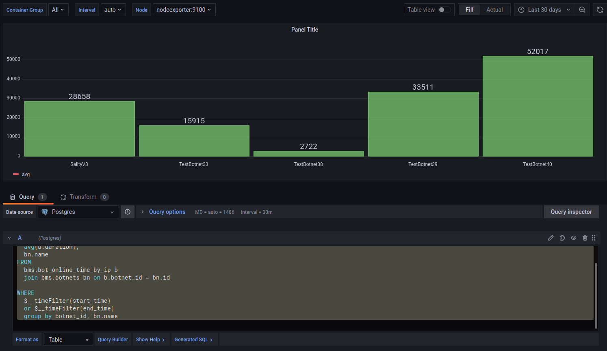
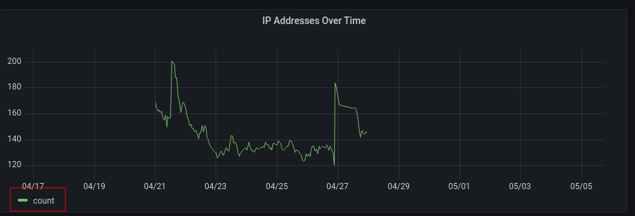

# Measuring Churn in P2P Botnets

P2P botnets, in contrast to regular, centralized botnets, do not require a command and control server, that poses a single point of failure when trying to shut the network down.
This greatly complicates take-down attempts, but on the other hand, the open design of the network where anybody can join and participate by receiving traffic, allows for some interesting monitoring concepts.
In this project, we aim to measure the churn of P2P botnets in an existing monitoring system.


## Problem: Churn

We call churn the dynamic peer participation or the the independent arrival and departure of peers [^churn]. Peer participation is highly dynamic. Therefore churn remains poorly understood. It is difficult to accurately measure and aggregate the online times of peers in P2P botnets. Monitoring and observing the patterns of those online times helps to better categorize the affected devices. In light of the ever increasing amount of IoT devices and there rather poor security, those get targeted often. But also end user systems and servers can be afflicted. The observation of their corresponding online times can ease the classification of infected devices which in and of itself is an intriguing metric.

## Existing System: BMS

The Botnet Monitoring System (BMS) is a platform to crawl and monitor P2P botnets and building statistics over time [^bms].
Currently the following botnets are being observed:

* DDG: a cryptocurrency mining botnet (Monero), mostly aimed at database servers [^ddg] [^ddg_netlab].
* Hajime: IoT botnet, targeting mostly the same unsecured/badly secured IoT devices as Mirai [^hajime]
* Hide 'n' Seek: IoT devices and misconfigured database servers (e.g. MongoDB, CouchDB), cryptocurrency mining [^hns]
* Mozi: IoT, DDoS, data exfiltration [^mozi]
* Sality: Windows, file infector, spam, proxy, data exfiltration, DDoS [^sality]

A requirement of the task was to integrate the implemented solution into BMS, allowing to mesh properly with the already existing database. Futhermore additional grafana dashboards were required to display the newly aggregated metrics.

## Implementation

The solution was implemented as a scheduler in Python, running in a Docker container, that would periodically query replies we received from bots and would calculate the online sessions for each bot.

A session is defined as a consecutive series of 5 minute time buckets in which a peer is confirmed to be online. If a peer hasn't responded for more than 15 minutes, the session is considered closed and a new session starts, if the peer is seen again. Since a time period is selected during the evaluation, sessions without start time and end times do exists. Sessions without start times are defined as active until the end time and sessions without end times are still active. 

We recorded sessions both based on IP address + port and the unique bot ID, the peer uses inside the network.
Major differences in those sessions would be an indicator for either more than one peer using the same IP (e.g. devices behind a NAT) or really long running nodes using a residential internet connection that rotates IP addresses periodically.

For IP based sessions, the name of the autonomous system (AS) was recorded as well so it is possible to correlate geographic location to specific churn behaviour.

    (amm30298, brv45530, ngd31951)

### Data Aggregation

The picture below shows the steps taken for building the entries for the online times table of bots. On start up all sessions that are flagged as open are queried, transformed into python objects and stored in memory. This happens for both the IP + port and the unique bot ID respectively. Assuming the system had a cold start or the containing docker container needed to be restarted, it helps to decrease load because already finished sessions can be ignored.


*Processing steps for creation of sessions*

For the scheduler we defined a cycle of 5 minutes which corresponds to the size of our time buckets and the defined time window frame. During the scheduled tasks the session with the most recent start (if the session is still open) or end time is queried to determine a starting point. Following that all bot replies beginning from this timestamp that are registered in the database are selected and transformed into session objects. As mentioned before open sessions with no replies after a time frame of 15 minutes are set to closed. All those sessions are then inserted into the data base. Here we use the UPSERT feature of postgres to either update existing sessions or insert new ones.

For IP sessions, there is another final step after closing a session, that will load all Bot IDs, the IP address was seen using while the session was active.
While in most cases, this would be one ID per session, for botnets that target end user devices like mobile phones and computers behind NATs, might have multiple IDs per IP address.

    (amm30298, brv45530)

### Max Count Aggregation

Using the max-count aggregation [^maxcount], we also calculated the maximum number of active sessions per AS or country per day.
This helps to see in which parts of the world a specific botnet is mostly active and also if a botnet is growing, shrinking or staying roughly the same size.

For max-count, the start of each session is treated as `+ 1` and the end of a session as `- 1`.
These events are sorted and iterated over and applied to a counter.
The maximum value represents the max-count and is persisted.

```python
events = {}
for ses in sessions:
    start_key = ses.start.timestamp()
    end_key = ses.end.timestamp()
    events[start_key] = events.get(start_key, 0) + 1
    events[end_key] = events.get(end_key, 0) - 1

pop = 0
max_pop = 0
start_ts = start.timestamp()
end_ts = end.timestamp()
for key in sorted(events.keys()):
    val = events[key]
    if start_ts < key < end_ts:
        max_pop = max(max_pop, pop, pop + val)
    pop += val

return max_pop
```

While mostly trivial in the implementation, this metric is interesting because it shows the impact of a botnet and might give clues about the operators.
There's a good chance that the country in which a botnet is mostly active is also the country where it originates.
On the other hand an even distribution of peers between countries could hint at an organized, international team running the botnet.

    (ngd31951)

## Dashboards

For the evaluation we created some dashboards to graphically illustrate the results.
Since BMS already comes with a Grafana instance, we could use that to create the dashboards.
The following dashboard shows for example the average duration of all sessions of the different botnets in a time period. The time period can be set arbitrary but the datasets must be in the database to see reasonable results.



    (brv45530, ngd31951)

This dashboard shows the change of the bots over time. To get the number of active bots in a selected time period IP addresses were counted:



    (amm30298)

The graphs in the screenshots might not represent the real-world.
While we used actual data from the Sality botnet, it was only over the duration of one week and might be missing information for longer running sessions.


## Problems

Most problems we encountered, were performance problems. The solution was correct on small test datasets but did not perform well or at all on real world data.

Finding sessions by querying time frames manually and selecting distinct `IP + Port` combinations in those buckets resulted in slow runtime since a round trip to the database was needed for each frame.

```sql
SELECT bot_id, ip, port, botnet_id
FROM bot_edges
WHERE time_seen BETWEEN %(start)s AND %(start)s + %(frame)s
```

With this query, a loop was needed to query each frame separately.
The PostgreSQL extension `Timescale` offers a function `time_bucket` [^time_bucket] to perform an equivalent operation on the database, which allows to query many time frames at once and reduces the round trips from `duration / bucket_size` to one.

```sql
SELECT time_bucket(%(bucket_size)s, time_seen), bot_id, ip, port, botnet_id
FROM bot_edges
WHERE br.time_seen >= %(start)s
```

    (brv45530)

Other minor problems included misunderstanding of the used programming language, e.g. Python default parameters are evaluated once and not on each function call:
Given a function `def foo(when = datetime.now())`, the default value for `when` is calculated once when first calling the function and each subsequent call invocation `foo` will get the earlier value of `when`.

Also assuming that a List of tuples with start and end times for sessions was already sorted lead to a minor hiccup. This lead to wrong parameters being given for calculation and resulted in sessions with a negative duration and many small sessions since consecutive time buckets would not be merged into the same session.

    (ngd31951)

First iterations of the tables and session representation overloaded the semantic of the session `end_time`.
If it was not set (e.g. `NULL` in SQL or `None` in Python), the session was considered open, else it was considered closed.
This caused multiple problems, e.g. when trying to extend a session, only the `start_time` was set and checks, if a new bucket is part the same session would fail depending on how the objects were constructed.
This was solved by introducing another column and field to track the open/closed status.
This change also makes analysis of the data easier, since we now have the correct session duration even for open sessions.

    (amm30298)

### Unfinished Sessions

Since currently active sessions can be considered working state of the application, problems could occur, if the scheduler is stopped and started again later.
It could happen, that earlier active sessions are not closed properly or merged with the current session, if a peer is still active.
Therefore, when starting the task, it must first load all still open sessions from the database, and perform analysis the churn on those to decide if the session has ended in the meantime or if it is still active and has to be merged with the currently active session.

    (amm30298, brv45530, ngd31951)

## Findings

The analysis of the churn behaviour and their corresponding geolocation, showed the impacts of the Chinese Great Firewall, where peers using Chinese IP addresses would have problems connecting at certain times of the day, which results in many small sessions instead of one long session.

## References

[^bms]: [Poster: Challenges of Accurately Measuring Churn in P2P Botnets](https://dl.acm.org/doi/10.1145/3319535.3363281) (Böck, Leon and Karuppayah, Shankar and Fong, Kory and Mühlhäuser, Max and Vasilomanolakis, Emmanouil)
[^ddg]: [DDG (Malware Family)](https://malpedia.caad.fkie.fraunhofer.de/details/elf.ddg) (Fraunhofer-Institut für Kommunikation, Informationsverarbeitung und Ergonomie FKIE)
[^ddg_netlab]: [DDG: A Mining Botnet Aiming at Database Servers](https://blog.netlab.360.com/ddg-a-mining-botnet-aiming-at-database-servers/) ([https://netlab.360.com/](Network Security Research Lab at 360))
[^hajime]: [Measurement and Analysis of Hajime, a Peer-to-peer IoT Botnet](https://par.nsf.gov/servlets/purl/10096257) (Herwig, Stephen and Harvey, Katura and Hughey, George and Roberts, Richard and Levin, Dave and University of Maryland and Max Planck Institute for Software Systems (MPI-SWS))
[^hns]: [Hide ‘N Seek botnet continues infecting devices with default credentials, building a P2P network and more](https://blog.avast.com/hide-n-seek-botnet-continues) (Avast)
[^mozi]: [Mozi, Another Botnet Using DHT](https://blog.netlab.360.com/mozi-another-botnet-using-dht/) (Turing, Alex and Wang, Hui)
[^sality]: [Sality: Story of a Peer-to-Peer Viral Network](https://web.archive.org/web/20120403180815/http://www.symantec.com/content/en/us/enterprise/media/security_response/whitepapers/sality_peer_to_peer_viral_network.pdf) (Falliere, Nicolas)
[^time_bucket]: [Timescale `time_bucket()`](https://docs.timescale.com/api/latest/hyperfunctions/time_bucket/)
[^maxcount]: [Max-Count Aggregation Estimation for Moving Points](https://ieeexplore.ieee.org/abstract/document/1314426) (Chen, Yi and Revesz, Peter)
[^churn]: [Understanding churn in peer-to-peer networks](https://dl.acm.org/doi/abs/10.1145/1177080.1177105) (Daniel, Stutzbach and Reza, Rejaie)
